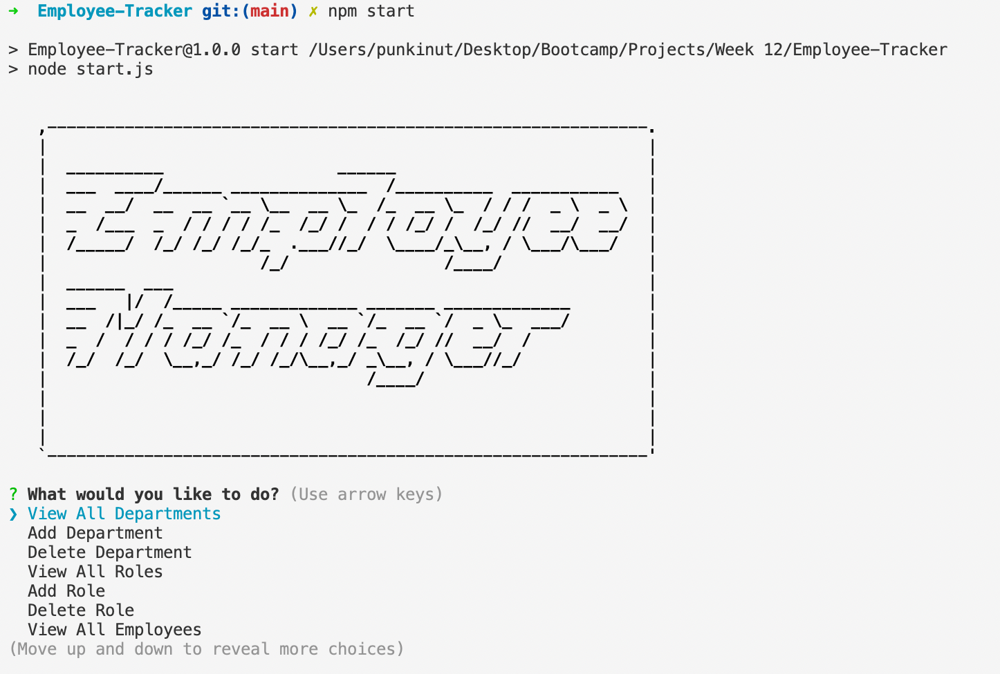
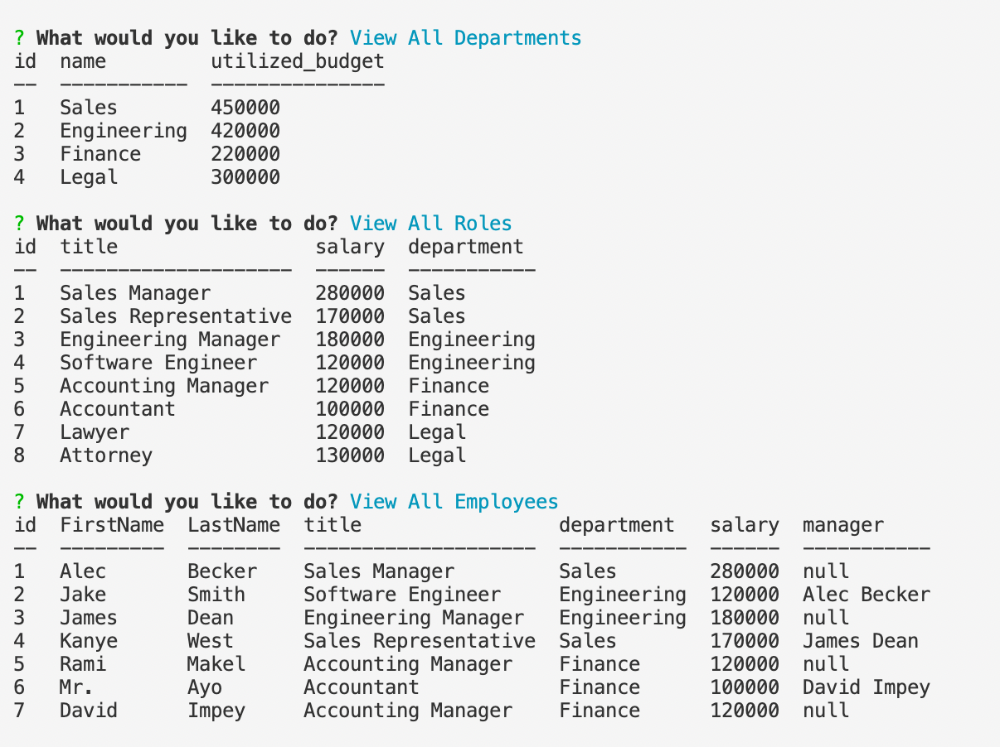

# Employee-Tracker
A mini application that allows to manage your employees | Deployed in the console

## Deployment

In order to deploy the application you will have to execute it in node by opening it up in the terminal and typing 'npm start' after installing the packages. 

Video Demo: [Video Demo](https://www.youtube.com/watch?v=xZg3TGpeHgc)

## Why make this?
This is designed for anyone who wants to edit and keep track of their employee database.

## My goal
The goal was to write a completed back-end application that would be able to interact with a database in SQL. 

## Running the application

First you will have install the npm packages from the json file by running 'npm install'. Then will need to run 'npm start' in the terminal to initiate the application

## Opening

This is the first thing you see when you open up the application

## Display Example

Here is a screenshot that shows an example of viewing the data via the prompts.

## End note
I hope you enjoyed going through my application and hopefully you will be able track your employees 👍